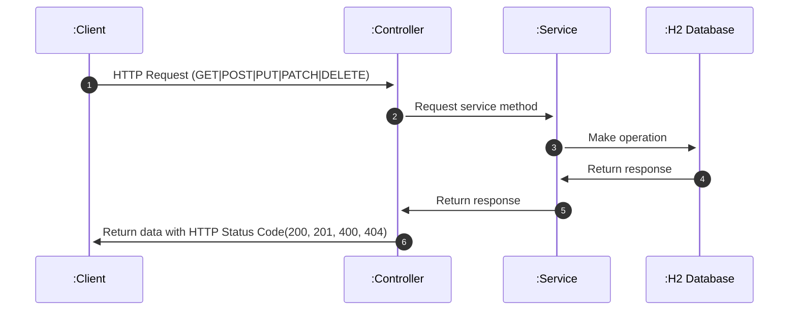

# user-apirest
## Como usar
### Versiones
```
Java 11+
Apache-maven 3.8.5
```
### Ejecutar comando
```
mvn clean install spring-boot:run
```
### Para probar los metodos ingresar mediante swagger
```
http://localhost:8080/users-backend/swagger-ui/index.html
```
### Para revisar base de datos ingresar a h2 mediante url:
```
http://localhost:8080/users-backend/h2-console/
JDBC URL: jdbc:h2:mem:testdb
User Name: sa
Password: sa
```
### Objeto para pruebas
```
{
  "name": "User Name",
  "mail": "mailtest@example.cl",
  "pass": "Test.1234!",
  "phones": [
  {
      "number": "12345678",
      "cityCode": "2",
      "countryCode": "51"
    },
    {
      "number": "87654321",
      "cityCode": "12",
      "countryCode": "13"
    }
  ]
}
```
## Diagrama secuencial

